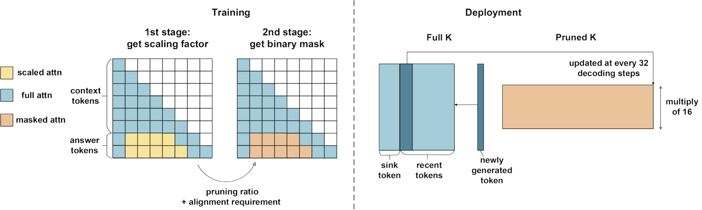

# LeanK: Learnable K Cache Channel Pruning for Efficient Decoding

Building upon the observation that QK vectors are **statically sparse** in the **channel (head_dim)** dimension, LeanK uses a learning-based approach to obtain channel-wise static mask used for KV Cache pruning. 

Experiments demonstrate up to **70%** K cache and **16%–18%** V cache memory reduction, reduces GPU memory and accelerates decoding without sacrificing accuracy.

<p align="center">
  
</p>


### Quick Start: Use LeanK with pretrained static channel patterns

Requirement: install the latest version of minference and tilelang

Add the following patch to enable LeanK decoding patched on Huggingface transformers: 

```diff
from transformers import AutoModelForCausalLM, AutoTokenizer
+ from minference import MInference

model_name = "meta-llama/Llama-3.1-8B-Instruct"

tokenizer = AutoTokenizer.from_pretrained(model_name)
model = AutoModelForCausalLM.from_pretrained(
    model_name,
    torch_dtype="auto",
    device_map="cuda",
    _attn_implementation="flash_attention_2",
)

+minference_patch = MInference(
+    attn_type="dense", model_name=model_name, kv_type="leank"
+)
+model = minference_patch(model)

prompt = open("narrativeqa_example.txt").read()
batch_inputs = tokenizer(prompt, return_tensors="pt").to("cuda")

outputs = model.generate(**batch_inputs, max_new_tokens=512)
generated_text = tokenizer.decode(
    outputs[0][batch_inputs["input_ids"].shape[1] :], skip_special_tokens=True
)
print(f"Generated text: {generated_text!r}")
```

Note: for unseen sequence length, Tilelang kernel compilation may take considerable longer time. It will be much faster once the kernel is compiled and kept in cache. 

### Environment Setup

```bash
conda create -yn leank python=3.10
conda activate leank

conda install -y git
conda install -y nvidia/label/cuda-12.4.0::cuda-toolkit
conda install -y nvidia::cuda-cudart-dev
conda install -y pytorch torchvision torchaudio pytorch-cuda=12.4 -c pytorch -c nvidia

# Training environment
pip install transformers==4.48.0 accelerate sentencepiece datasets wandb zstandard matplotlib huggingface_hub==0.25.2
pip install ninja packaging
pip install flash-attn==2.7.1.post4 --no-build-isolation
pip install cloudpickle wonderwords bs4 nltk html2text pyyaml

# Deployment and evaluation
pip install tilelang==0.1.5
pip install minference

pip install jsonlines pandas seaborn tqdm 
pip install jieba mysql-connector-python fuzzywuzzy rouge SentencePiece 
pip install git+https://github.com/NVIDIA/NeMo.git 

pip install ipython hydra-core lightning lhotse jiwer librosa pyannote.core pyannote-core webdataset editdistance pyannote.metrics tenacity 
```


### Data Preparation
Download PaulGraham Essays dataset for training:

```bash
# for training
cd leank/data
python download_paulgraham_essay.py 
python -c "import nltk; nltk.download('punkt_tab')"
wget https://huggingface.co/datasets/togethercomputer/Long-Data-Collections/resolve/main/fine-tune/booksum.jsonl.zst

# for evaluation
cd eval/RULER/scripts/data/synthetic/json 
python download_paulgraham_essay.py 
bash download_qa_dataset.sh 
```

### Training

```bash
# run double-stage training on Llama-3.1-8B-Instruct
torchrun --nnodes 1 --nproc_per_node 1 train.py --config scripts/llama3.1-8b.yaml
torchrun --nnodes 1 --nproc_per_node 1 train.py --config scripts/llama3.1-8b.yaml --stage2 

# run double-stage training on Qwen2.5-7B-Instruct w/o Yarn
torchrun --nnodes 1 --nproc_per_node 1 train.py --config scripts/qwen2.5-7b-yarn.yaml
torchrun --nnodes 1 --nproc_per_node 1 train.py --config scripts/qwen2.5-7b-yarn.yaml --stage2 

# run double-stage training on Qwen2.5-7B-Instruct w/ Yarn
torchrun --nnodes 1 --nproc_per_node 1 train.py --config scripts/qwen2.5-7b.yaml
torchrun --nnodes 1 --nproc_per_node 1 train.py --config scripts/qwen2.5-7b.yaml --stage2 
```

For Qwen w/ Yarn extrapolation, add the following to config.json for training and testing: 

```json
"rope_scaling": {
  "factor": 4.0,
  "original_max_position_embeddings": 32768,
  "type": "yarn"
}
```

### Evaluation

#### RULER

```bash
bash eval/RULER/run.sh llama3.1-8b-chat synthetic
```

#### LongBench

```bash
python eval/LongBench/pred.py --enable_leank --model_name_or_path meta-llama/Meta-Llama-3.1-8B-Instruct
python eval/LongBench/eval.py
```

#### Kernel benchmarking

```bash
python kernel_benchmark.py
```

Dense Attention (Tile-lang): 5.31 ms

LeanK Decoding (Average): 4.13 ms

#### End-to-end memory and latency test

```bash
python test_memory.py
```

| Method | Seq_len | Batch_size | Gen_time | Max_memory | KV_size |
| --- | --- | --- | --- | --- | --- | 
| HF | 4096 | 52 | 47.27 | 64.64 | 26.80 |
| LeanK | 4096 | 52 | 42.31 | 60.32 | 20.43 |
| LeanK | 4096 | 64 (1.2x larger) | 55.91 | 70.79 | 25.14 |


### Acknowledgements

This project incorporates code from [DuoAttention](https://github.com/mit-han-lab/duo-attention), [RULER](https://github.com/NVIDIA/RULER), [LongBench](https://github.com/THUDM/LongBench) and [Tile-Lang](https://github.com/tile-ai/tilelang). We deeply appreciate the contributions of the original authors.

