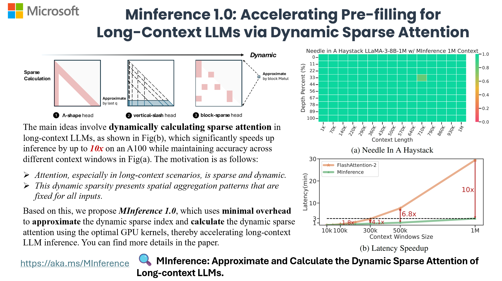

<div style="display: flex; align-items: center;">
    <div style="width: 100px; margin-right: 10px; height:auto;" align="left">
        
    </div>
    <div style="flex-grow: 1;" align="center">
        <h2 align="center">MInference: Million-Tokens Prompt Inference for LLMs</h2>
    </div>
</div>

<p align="center">
    | <a href="https://llmlingua.com/"><b>Project Page</b></a> |
    <a href="https://arxiv.org/abs/2406."><b>Paper</b></a> |
    <a href="https://huggingface.co/spaces/microsoft/MInference"><b>Demo</b></a> |
</p>

https://github.com/microsoft/MInference/assets/30883354/52613efc-738f-4081-8367-7123c81d6b19

## TL;DR

**MInference 1.0** leverages the dynamic sparse nature of LLMs' attention, which exhibits some static patterns, to speed up the pre-filling for long-context LLMs. It first determines offline which sparse pattern each head belongs to, then approximates the sparse index online and dynamically computes attention with the optimal custom kernels. This approach achieves up to a **10x speedup** for pre-filling on an A100 while maintaining accuracy.

- [MInference 1.0: Accelerating Pre-filling for Long-Context LLMs via Dynamic Sparse Attention](https://arxiv.org/abs/2406.) (Under Review)<br>
  _Huiqiang Jiang†, Yucheng Li†, Chengruidong Zhang†, Qianhui Wu, Xufang Luo, Surin Ahn, Zhenhua Han, Amir H. Abdi, Dongsheng Li, Chin-Yew Lin, Yuqing Yang and Lili Qiu_


## 🎥 Overview



## 🎯 Quick Start

### Requirements

- Torch
- FlashAttention-2
- Triton == 2.1.0

To get started with MInference, simply install it using pip:

```bash
pip install minference
```

### How to use MInference

for HF,
```diff
from transformers import pipeline
+from minference import MInference

pipe = pipeline("text-generation", model=model_name, torch_dtype="auto", device_map="auto")

# Patch MInference Module
+minference_patch = MInference("minference", model_name)
+pipe.model = minference_patch(pipe.model)

pipe(prompt, max_length=10)
```

for vLLM,

```diff
from vllm import LLM, SamplingParams
+ from minference import MInference

llm = LLM(model_name, max_num_seqs=1, enforce_eager=True, max_model_len=128000)

# Patch MInference Module
+minference_patch = MInference("vllm", model_name)
+llm = minference_patch(llm)

outputs = llm.generate(prompts, sampling_params)
```

## FAQ

For more insights and answers, visit our [FAQ section](./Transparency_FAQ.md).

**Q1: How to effectively evaluate the impact of dynamic sparse attention on the capabilities of long-context LLMs?**

To effectively evaluate long-context LLM capabilities, we tested: 1) effective  context window with RULER, 2) general long-context tasks with InfiniteBench, 3) retrieval tasks across different contexts and positions with Needle in a Haystack, and 4) language model prediction with PG-19.<br/>
We found that traditional methods perform poorly in retrieval tasks, with difficulty levels varying as follows: KV retrieval (every key as a needle) > Needle in a Haystack > Retrieval.Number > Retrieval PassKey. The key challenge is the semantic difference between needles and the haystack. Traditional methods perform better when the semantic difference is larger, as in passkey tasks. KV retrieval demands higher retrieval capabilities since any key can be a target, and multi-needle tasks are even more complex.<br/>
We will continue to update our results with more models and datasets in future versions.

**Q2: Does this dynamic sparse attention pattern only exist in long-context LLMs that are not fully trained?**

Firstly, attention is dynamically sparse, and this is true for both short- and long-contexts, a characteristic inherent to the attention mechanism.
Additionally, we selected the state-of-the-art open-source long-context LLM, LLaMA-3-8B-Instruct-1M, which has an effective context window size of 16K. With MInference, this can be extended to 32K.
We will continue to adapt our method to other advanced long-context LLMs and update our results. We will also explore the theoretical reasons behind this dynamic sparse attention pattern.

**Q3: What is the relationship between MInference, SSM, Linear Attention, and Sparse Attention?**

All four approaches (MInference, SSM, Linear Attention, and Sparse Attention) are efficient solutions for optimizing the high complexity of attention in Transformers, each introducing inductive bias from different perspectives. Notably, the latter three require training from scratch.
Additionally, recent works like Mamba-2 and Unified Implicit Attention Representation unify SSM and Linear Attention as static sparse attention. Mamba-2 itself is a block-wise sparse attention method.
Intuitively, the significant sparse redundancy in attention suggests that these approaches have potential. However, static sparse attention may not handle dynamic semantic associations well, especially in complex tasks. Dynamic sparse attention, on the other hand, holds potential for better managing these dynamic relationships.

## Citation

If you find MInference useful or relevant to your project and research, please kindly cite our paper:

@article{jiang2024minference,
    title={MInference 1.0: Accelerating Pre-filling for Long-Context LLMs via Dynamic Sparse Attention},
    author={Jiang, Huiqiang and Li, Yucheng and Zhang, Chengruidong and Wu, Qianhui and Luo, Xufang and Ahn, Surin and Han, Zhenhua and Abdi, Amir H and Li, Dongsheng and Lin, Chin-Yew and Yang, Yuqing and Qiu, Lili},
    journal={arXiv},
    year={2024}
}

## Contributing

This project welcomes contributions and suggestions.  Most contributions require you to agree to a
Contributor License Agreement (CLA) declaring that you have the right to, and actually do, grant us
the rights to use your contribution. For details, visit https://cla.opensource.microsoft.com.

When you submit a pull request, a CLA bot will automatically determine whether you need to provide
a CLA and decorate the PR appropriately (e.g., status check, comment). Simply follow the instructions
provided by the bot. You will only need to do this once across all repos using our CLA.

This project has adopted the [Microsoft Open Source Code of Conduct](https://opensource.microsoft.com/codeofconduct/).
For more information see the [Code of Conduct FAQ](https://opensource.microsoft.com/codeofconduct/faq/) or
contact [opencode@microsoft.com](mailto:opencode@microsoft.com) with any additional questions or comments.

## Trademarks

This project may contain trademarks or logos for projects, products, or services. Authorized use of Microsoft
trademarks or logos is subject to and must follow
[Microsoft's Trademark & Brand Guidelines](https://www.microsoft.com/en-us/legal/intellectualproperty/trademarks/usage/general).
Use of Microsoft trademarks or logos in modified versions of this project must not cause confusion or imply Microsoft sponsorship.
Any use of third-party trademarks or logos are subject to those third-party's policies.
