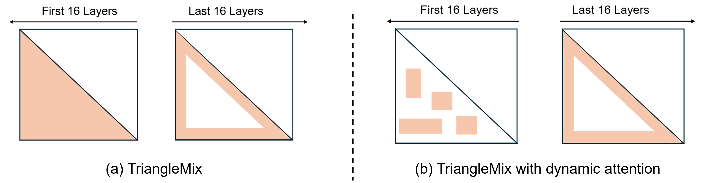
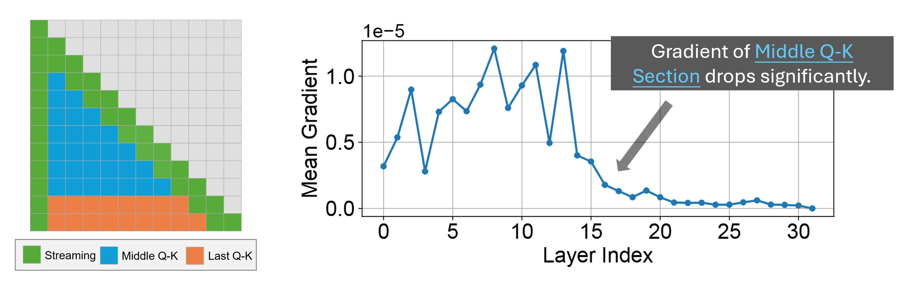

# TriangleMix: A Lossless and Efficient Attention Pattern for Long Context Prefilling

We propose `TriangleMix`, a training-free static attention pattern for efficient long context prefilling. 

<p align="center">
  
</p>

1. `TriangleMix` applies dense attention in the shallow layers and transitions to triangle attention in the deeper layers. Notably, triangle attention **reduces the $\mathcal{O}(N^2)$ attention complexity to $\mathcal{O}(N)$**, which is a significant complexity decrease, especially for long input sequences.
2. `TriangleMix` can be integrated with dynamic attention methods (e.g., `MInference` or `FlexPrefill`) by utilizing dynamic attention in the shallow layers and switching to triangle sparse attention in the deeper layers.

Extensive experiments demonstrate that `TriangleMix` reduces attention overhead by **3.7× to 15.3×** in deep layers, and **decreases overall Time-to-First-Token (TTFT) by 12% to 32%** for sequence lengths ranging from 32K to 128K, without sacrificing model accuracy. Moreover, the integration with dynamic sparsity methods to achieve further speedup, e.g. **accelerating MInference by 19% at 128K**, for example, highlighting its potential to enhance LLM inference efficiency.


<p align="center">
  
</p>


We discover this pattern using a novel **gradient-based method**. The causal attention is divided into three sections. The gradient measures the importance of each section relative to the outputs. We observe that the importance of the middle Q-K section drops significantly in deeper layers.

Our hypothesis is that this arises from a **Train–Test Misalignment**:

- **Training**: The loss is applied uniformly to all positions in the input. For example, if the input has 4000 tokens, the model is trained to predict token 2001 given tokens 1–2000.
- **Inference**: We only care about predicting tokens after the prompt, so predicting tokens inside the prompt (like token 2001) is irrelevant.

We find the Middle Q-K region is important primarily for predicting tokens within the prompt, while for generation tasks focused on tokens after the prompt, the Middle Q-K in deeper layers is largely redundant. Detailed analysis on this topic is provided in the paper.

## Quick Start

Make sure you have installed the latest `minference`:

```bash
conda create -n minference python=3.11
conda activate minference
pip install "transformers[torch]"
pip install flash-attn --no-build-isolation
git clone https://github.com/microsoft/MInference.git ~/MInference
cd ~/MInference
pip install -e .
```

Then you can use the `tri_mix` methods:

```diff
from transformers import AutoModelForCausalLM, AutoTokenizer
+ from minference import MInference

model_name = "meta-llama/Llama-3.1-8B-Instruct"

tokenizer = AutoTokenizer.from_pretrained(model_name, use_fast=False)
model = AutoModelForCausalLM.from_pretrained(
    model_name,
    torch_dtype=torch.bfloat16,
    device_map="auto",
    trust_remote_code=True,
    attn_implementation="flash_attention_2",
)

+minference_patch = MInference(
+    attn_type="tri_mix",
+    model_name=model_name,
+    attn_kwargs={"last_n": 128, "starting_layer": 16, "n_local": 512, "n_init": 8},
+)
+model = minference_patch(model)

prompt = "your prompt here"
inputs = tokenizer(prompt, return_tensors="pt", add_special_tokens=False).to(model.device)
output = model.generate(**inputs, do_sample=False, max_new_tokens=50)
```

## Reproduce Ruler Performance

First, setup ruler environments. See [setup_ruler.sh](./setup_ruler.sh) for details.

Then, change directory to `<minference>/TriangleMix/ruler/`.

Run dense attention:

```bash
mkdir -p ./results/dense
bash run_dense.sh meta-llama/Llama-3.1-8B-Instruct minference ./results/dense
```

Run `TriangleMix`:

```bash
mkdir -p ./results/tri_mix
bash run_tri_mix.sh meta-llama/Llama-3.1-8B-Instruct minference ./results/tri_mix 16
```

Results on 128K context length (Minimal drop from 77.6 to 77.3):

| Method      | AVG  | NI.SG1 | NI.SG2 | NI.SG3 | NI.MK1 | NI.MK2 | NI.MK3 | NI.MV  | NI.MQ  | VT   | CWE  | FWE   | QA1  | QA2  |
|-------------|------|--------|--------|--------|--------|--------|--------|--------|--------|------|------|-------|------|------|
| Dense       | 77.6 | 100.0  | 96.0   | 100.0  | 95.0   | 91.0   | 62.0   | 97.25  | 98.5   | 90.0 | 2.2  | 57.33 | 77.0 | 43.0 |
| TriangleMix | 77.3 | 100.0  | 96.0   | 100.0  | 95.0   | 91.0   | 63.0   | 97.75  | 98.0   | 93.2 | 0.0  | 50.67 | 77.0 | 43.0 |


## Reproduce Efficiency Metrics

We provide a speed test script `speed_test.py`. This script measures the TTFT (time-to-first-token).

```bash
python speed_test.py --method dense --model_name meta-llama/Llama-3.1-8B-Instruct
python speed_test.py --method tri_mix --model_name meta-llama/Llama-3.1-8B-Instruct
python speed_test.py --method tri_mix_minfernece --model_name meta-llama/Llama-3.1-8B-Instruct
```

TTFT in seconds on A100 80GB:

| Method             | 32K         | 48K         | 64K         | 80K         | 96K         | 112K        | 128K        |
|--------------------|-------------|-------------|-------------|-------------|-------------|-------------|-------------|
| Dense              | 4.1         | 7.3         | 11.2        | 15.9        | 21.3        | 27.5        | 34.5        |
| MInference         | 5.5 (+34%)  | 7.8 (+7%)   | 10.1 (-10%) | 12.3 (-23%) | 13.4 (-37%) | 15.9 (-42%) | 18.0 (-48%) |
| TriangleMix        | **3.6 (-12%)**  | **5.9 (-19%)**  | 8.6 (-23%)  | 11.7 (-26%) | 15.2 (-29%) | 19.1 (-31%) | 23.4 (-32%) |
| Ours + MInference  | 4.2 (+2%)   | 6.0 (-18%)  | **7.7 (-31%)**  | **9.5 (-40%)**  | **10.9 (-49%)** | **12.7 (-54%)** | **14.5 (-58%)** |

